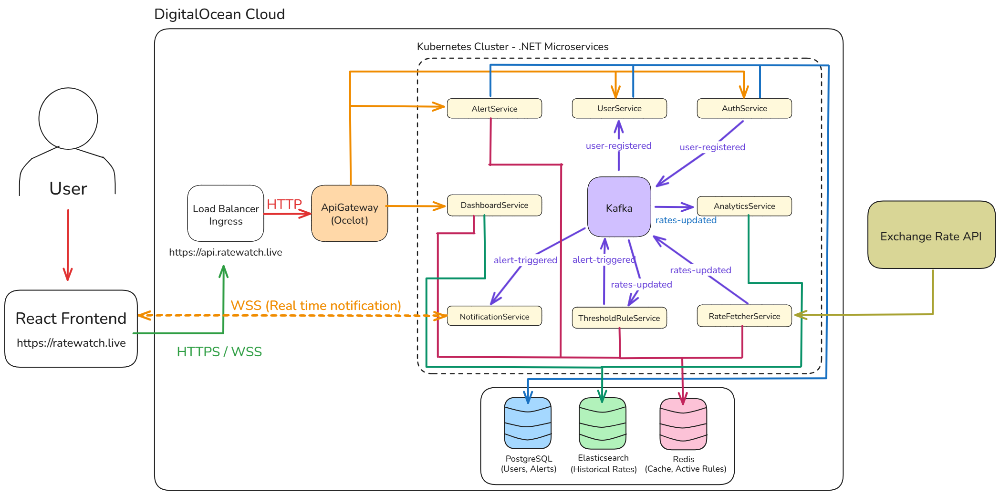

# RateWatch: A Real-Time Currency Exchange Rate Monitoring Platform



## 🚀 Introduction

RateWatch is a full-featured, cloud-native application designed to provide users with real-time currency exchange rate information. It's built on a modern, event-driven microservices architecture.

Users can:
*   **Track** live exchange rates.
*   **Create** personalized alerts to be notified when a currency pair reaches a target value.
*   **Analyze** historical rate data through interactive charts.
*   Receive **real-time notifications** via WebSockets when an alert triggered.

**Live Demo:**
*   **Frontend Application:** [`https://ratewatch.live`](https://ratewatch.live)
*   **Backend API Endpoint:** [`https://api.ratewatch.live`](https://api.ratewatch.live)

---

## 🏛️ System Architecture

The RateWatch platform is built using a **Microservices Architecture**, where each core functionality is an independent, scalable, and deployable service. Services can communicate asynchronously through a central messaging backbone (Kafka).

### Core Components & Data Flow:

1.  **Client (React Frontend):** The user interface, built with React, TypeScript, and Vite. It communicates with the backend via a single API Gateway.
2.  **API Gateway (Ocelot):** A single entry point for all client requests. It handles authentication, routing, and aggregates data from various microservices.
3.  **Synchronous Services (Web APIs):**
    *   `AuthService`: Manages user registration, login, and JWT generation.
    *   `UserService`: Manages user profile data.
    *   `AlertService`: Handles CRUD operations for user-defined alerts.
    *   `DashboardService`: Provides aggregated data (latest & historical rates) to the frontend.
4.  **Asynchronous Services (Workers):**
    *   `RateFetcherService`: Periodically fetches the latest currency data from an external API.
    *   `ThresholdRuleService`: Compares incoming rates with user alerts and triggers events.
    *   `AnalyticsService`: Archives all rate data for historical analysis.
    *   `NotificationService`: Pushes real-time notifications to connected clients via WebSockets.
5.  **Data & Messaging Infrastructure:**
    *   **PostgreSQL:** The primary "source of truth" for persistent data like users and alerts.
    *   **Redis:** A high-speed cache for "hot data," such as the latest exchange rates and active alert rules.
    *   **Kafka:** The asynchronous messaging backbone that decouples the microservices.
    *   **Elasticsearch:** A powerful search engine used for storing and querying time-series historical rate data.

---

## 💻 Technology Stack

This project utilizes a modern, robust, and scalable technology stack.

### Backend & DevOps

| Technology | Role & Purpose |
| :--- | :--- |
| **.NET 8 & C#** | The core framework for building all high-performance microservices. |
| **Docker** | Containerizes each service for consistent development and production environments. |
| **Kubernetes (DOKS)**| Orchestrates all containerized services in the DigitalOcean cloud, managing scaling and resilience. |
| **PostgreSQL** | The primary relational database for persistent, critical data. |
| **Redis** | In-memory data store used for caching and speed-critical operations. |
| **Kafka** | Distributed event streaming platform for asynchronous, decoupled inter-service communication. |
| **Elasticsearch** | Search and analytics engine for storing and querying historical time-series data. |
| **Ocelot** | A lightweight API Gateway for the .NET platform. |
| **NGINX Ingress** | Manages external access to services in the Kubernetes cluster, handling routing and SSL. |
| **GitHub Actions** | Implements the complete CI/CD pipeline for automated builds and deployments. |


## 🚀 Getting Started

### Local Development (`docker-compose`)

The entire backend infrastructure and all services can be run locally with a single command.

1.  **Clone the repository:**
    ```bash
    git clone https://github.com/bsametarman/RateWatch-Backend.git
    cd RateWatch-Backend
    ```
2.  **Set up environment variables:**
    *   Create a `.env` file in the root directory.
    *   Add your `ExchangeRateApi__ApiKey` to this file. See `.env.example` for the format.

3.  **Run the application:**
    ```bash
    docker-compose up --build
    ```
    The API Gateway will be available at `http://localhost:8000`.

### Cloud Deployment (Kubernetes & CI/CD)

This project is configured for fully automated deployment to a DigitalOcean Kubernetes cluster via GitHub Actions.

1.  **CI (Continuous Integration):** On every push to the `main` branch, the `.github/workflows/ci.yaml` workflow is triggered. It builds a new Docker image for each modified service and pushes it to GitHub Container Registry (ghcr.io).
2.  **CD (Continuous Deployment):** Upon successful completion of the CI workflow, the `.github/workflows/cd.yaml` workflow is triggered. It connects to the Kubernetes cluster and applies all manifests located in the `k8s/apps/` directory, performing a zero-downtime rolling update of the services.

For a detailed guide on setting up the cloud infrastructure (Kubernetes cluster, secrets, etc.), please refer to the comments within the `k8s/` and `.github/` directories.

---

## ✨ Features & Highlights

*   **Event-Driven Architecture:** Services react to events via Kafka, promoting scalability and resilience.
*   **Automated DevOps:** A complete CI/CD pipeline ensures that every code change is automatically built, tested, and deployed.
*   **Cloud-Native:** Designed from the ground up to run on Kubernetes, leveraging modern cloud principles.
*   **Real-Time Notifications:** Utilizes WebSockets for instant communication from the backend to the client when an alert is triggered.
*   **Clean & Layered Architecture:** Each microservice follows SOLID principles with a clear separation of concerns (Domain, Application, Infrastructure).
*   **High Performance:** Caching with Redis and efficient data querying with Elasticsearch ensure a fast user experience.